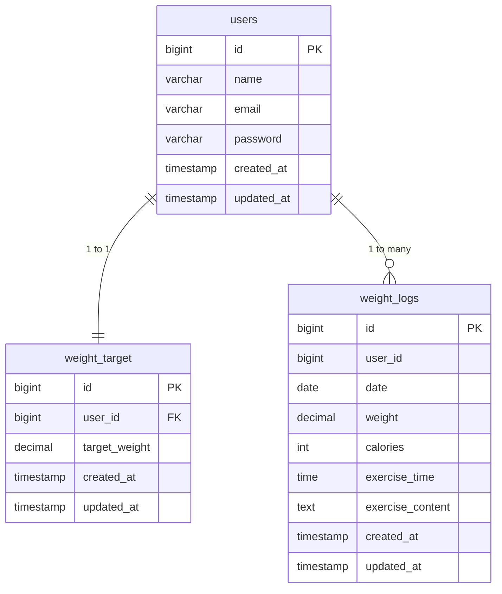

# test3
# ER図

```mermaid
erDiagram

    users {
        bigint id PK
        varchar name
        varchar email
        varchar password
        timestamp created_at
        timestamp updated_at
    }

    weight_target {
        bigint id PK
        bigint user_id FK
        decimal target_weight
        timestamp created_at
        timestamp updated_at
    }

    weight_logs {
        bigint id PK
        bigint user_id 
        date date
        decimal weight
        int calories
        time exercise_time
        text exercise_content
        timestamp created_at
        timestamp updated_at
    }

    users ||--|| weight_target : "1 to 1"
    users ||--o{ weight_logs : "1 to many"

```
